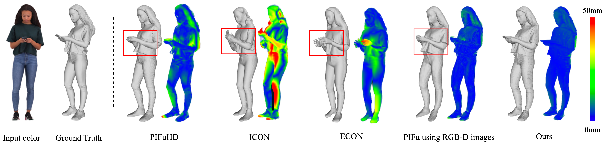

# MaskRecon: High-quality Human Reconstruction via Masked Autoencoders Using a Single RGB-D image
> Xing Li, Yangyu Fan, Zhe Guo, Zhibo Rao, Yu Duan, Shiya Liu



We plan to release the training and testing code of MaskRecon in this repository as soon as possible.  Any discussions or questions would be welcome!


### Software Environment
1. OS Environment
```
os >= linux 16.04
cudaToolKit == 10.1
cudnn == 7.3.6
```

2. Python Environment 
```
python == 3.8.5
pythorch >= 1.15.0
```
---
### Hardware Environment
The framework only can be used in GPUs.

## Pretrained model

We will provide the pretrained diffusion models for stereo matching including 20 degree and 45 degree as soon as possible. You can download and put them into the `checkpoints/` directory.

[Download: pretrained model](https://pan.quark.cn/s/6e487d04be2e)

### Train the model by running:
0. Install the JackFramework lib from Github (https://github.com/Archaic-Atom/JackFramework)
```
$ cd JackFramework/
$ ./install.sh
```

1. Get the Training list or Testing list （You need rewrite the code by your path, and my related demo code can be found in Source/Tools/genrate_**_traning_path.py）
```
$ python ./Scripts/generate_thuman_training_path.py
```

2. Train the program, like:
```
$ ./Scripts/start_train_thuman_model.sh
```

3. Test the program, like:
```
$ ./Scripts/start_test_renderpeople_model.sh
```

---
### File Structure
```
BodyReconstruction
├── Datasets # Get it by ./generate_path.sh, you need build folder
│   ├── dataset_example_training_list.csv
|   ├── dataset_example_testing_list.csv
|   ├── dataset_example_testing_val_list.csv
│   └── ...
├── Scripts # Get it by ./generate_path.sh, you need build folder
│   ├── clean.sh         # clean the project
│   ├── generate_path.sh # generate the tranining or testing list like kitti2015_val_list
│   ├── start_train_dataset_model.sh # start training command
│   ├── start_test_dataset_model.sh # start training command
│   └── ...
├── Source # source code
│   ├── UserModelImplementation
│   │   ├── Models            # any models in this folder
│   │   ├── Dataloaders       # any dataloaders in this folder
│   │   ├── user_define.py    # any global variable in this fi
│   │   └── user_interface.py # to use model and Dataloader
│   ├── Tools # put some tools in this folder
│   ├── main.py
│   └── ...
├── LICENSE
└── README.md
```

---
### Structure of DEMO samples on the RenderPeople dataset
```
SampleImg
├── RENDER
│   └── rp_adanna_posed_001
│       ├── xxx.jpg --- the RGB image of view xxx 
├── DEPTH
│   └── rp_adanna_posed_001
│       ├── xxx.png --- the depth map of view xxx 
└── UV
    └── rp_adanna_posed_001
        ├── xxx.png --- the UV map of view xxx (obtained by DensePose)
```
### Visualization on Reconstructed 3D human on real-world
The results will be saved in `results`. To visualize the results, use [MeshLab]() to open `results/0000_mesh.ply`. The real data sourced from NormalGAN, which were collected using the Kinect V2 depth camera.


### Visualization on comparisons
We compare MaskRecon with PIFuHD, ICON, ECON, PIFu, and PIFu retained using RGBD images.


## Acknowledgments

Our project is benefit from these great resources:

- [NormalGAN: Learning Detailed 3D Human from a Single RGB-D Image](https://github.com/LizhenWangT/NormalGAN)
- [PIFu: Pixel-Aligned Implicit Function for High-Resolution Clothed Human Digitization](https://github.com/shunsukesaito/PIFu)

Thanks for their sharing code.

### Update log
#### 2024-05-09
1. Write ReadMe;

 